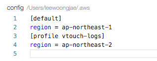

# 프로파일

**aws_session_token** : 당신의 credential의 세션 토큰 (세션 토큰만)


> cli 에서 직접 sts를 이용하여 credential을 받아온 경우 세션 토큰을 함께 보내야한다.

**metadata_service_timeout** : 메타데이터 서비스의 요청이 타임 아웃 될 때까지 기다리는 초의 수. 당신의 credential을 제공하기 위해 IAM롤을 사용하는 경우에 이용된다.

**metadata_service_num_attempts** : credential을 검색하려고 하려는 시도 의 수. 당신이 아마존 EC2 인스턴스 상에 IAM롤 사용을 확실히 알고 있다면, 어떤 간헐적인 오류가 시도됨을 확인하기 위해 이 값을 설정할 수 있다. 기본적으로 이 값 은 1 이다.


> 롤을 적용한 EC2인스턴스 상에서 실행되는 "애플리케이션(SDK), AWS CLI 및 Windows PowerShell용 도구 명령"은 **인스턴스 메타데이터**로부터 자동 임시 보안 자격 증명을 얻을 수 있습니다.
> 
> 임시 보안 자격 증명을 명시적으로 얻지 않아도 됩니다. AWS SDK, AWS CLI 및 Windows PowerShell용 도구가 EC2 인스턴스 메타데이터 서비스로부터 자격 증명을 자동으로 얻어 그것을 사용하기 때문입니다. 임시 자격 증명은 그 인스턴스에 연결된 역할에 대해 정의한 권한이 있습니다.

### * 프로파일이란?

다음의 4가지 항목을 기본적으로 설정해놓은 세트이다.

* AWS Access Key ID
* AWS Secret Access Key
* Default region name
* Default output format

### * Default 프로파일

아무 이름을 지정하지 않은채 시작하면 디폴트 프로파일로 시작하게 된다.

configure 명령어를 이용하여 항목을 설정한다.

```
LeeWoongjaeui-MacBook-Air:~ leewoongjae$ aws configure
AWS Access Key ID [****************CHPA]: 
AWS Secret Access Key [****************DJMj]: 
Default region name [ap-northeast-1]: 
Default output format [None]: 
```

### * [특정 이름] 프로파일

configure 명령어에 --profile 옵션으로 [특정 이름]을 주면 된다.

```
LeeWoongjaeui-MacBook-Air:~ leewoongjae$ aws configure --profile vtouch-logs
AWS Access Key ID [****************MLBA]: 
AWS Secret Access Key [****************8QG4]: 
Default region name [ap-northeast-2]: 
Default output format [None]: 
```

### * 프로파일을 이용한 실행

대부분의 명령어는 --profile 옵션으로 [프로파일 이름]을 받아 실행할 수 있다.
옵션을 주지ㅡ않으면 Default 로 실행된다.

```
LeeWoongjaeui-MacBook-Air:~ leewoongjae$ aws s3 ls --profile vtouch-logs
```

> vtouch-logs 라는 프로파일 설정으로 s3 ls 명령어를 실행하는 코드

```
LeeWoongjaeui-MacBook-Air:~ leewoongjae$ aws s3 ls
```

> Default 프로파일 설정으로 s3 ls 명령어를 실행하는 코드

### * aws-shell 에서 프로파일 활용하기

셸을 시작할때 특정 프로파일로 시작할 수 있다.

--profile 옵션으로 [프로파일 이름]을 받아 셸을 시작할 수 있다.
이렇게 시작하면 일반 명령어를 사용할 때 매번 --profile 옵션을 이용할 필요가 없다.
옵션을 주지 않으면 Default 로 실행된다.

```
LeeWoongjaeui-MacBook-Air:~ leewoongjae$ aws-shell --profile vtouch-logs
```

셸에 진입하여, 현재 사용중인 프로파일을 알아내고 바꿀수 있다.

```
aws> .profile
Current shell profile: no profile configured
You can change profiles using: .profile profile-name
```

> 현재 프로파일을 확인하는 코드. 프로파일이 설정되지 않았으므로 Default 프로파일로 동작한다.

```
aws> .profile vtouch-logs
Current shell profile changed to: vtouch-logs
```

> vtouch-logs 라는 이름의 프로파일로 변경하는 코드. 정상적으로 변경되었다.

```
aws> .profile
Current shell profile: vtouch-logs
```

> 다시 현재 프로파일을 확인하는 코드.

### * 내 컴퓨터에 저장된 프로파일 정보 파일 알아보기

네 가지의 정보 (AWS Access Key ID, AWS Secret Access Key, Default region name, Default output format)는 두개의 파일에 저장되어 있다.

* ~/.aws/config
* ~/.aws/credentials

각각 [default], [profile vtouch-logs] 이런식의 프로파일 명 아래에 "region = ap-northeast-1"과 같이 키와 값이 들어있다.

