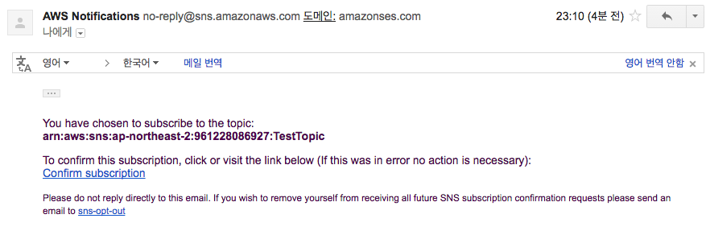

# SNS를 이용하여 이메일 보내기

전체적인 명령어의 전개는 다음과 같다.

* **Topic** 을 만들고,
* 그 안에 이메일을 발송하는 **Subscription** 을 만든다.
* **Publish** to topic으로 제목과 내용을 입력하여 발송한다.

바로 시작해보자!

SNS는 리전 단위의 서비스이다. 자신의 리전이 어디인지 생각해보고 진행하도록~!


---
```
aws> sns list-topics
{
    "Topics": []
}
```
> 현재 리전의 전체 토픽의 리스트를 리턴하는 명령이다. 당연히 그전에 아무것도 안해봤으면 저렇게 나온다.

---
```
aws> sns create-topic --name TestTopic
{
    "TopicArn": "arn:aws:sns:ap-northeast-2:961228086927:TestTopic"
}
```
> 토픽의 이름을 지정하여 새 토픽을 만드는 명령이다. 성공적으로 만들어지면, arn 을 리턴해준다.

---
```
aws> sns list-topics
{
    "Topics": [
        {
            "TopicArn": "arn:aws:sns:ap-northeast-2:961228086927:TestTopic"
        }
    ]
}
```

> 다시 한번 토픽의 리스트를 확인해보자. 처음과 다르게 만든 토픽을 볼 수 있다.

---
```
aws> sns list-subscriptions
{
    "Subscriptions": []
}
```

> 현재 리전의 전체 서브스크립션의 리스트를 리턴하는 명령이다. 아직 아무것도 만든것이 없기 때문에 리스트가 없다.

---
```
aws> sns list-subscriptions-by-topic --topic-arn arn:aws:sns:ap-northeast-2:961228086927:TestTopic
{
    "Subscriptions": []
}
```

> 토픽의 arn을 기준으로 서브스크립션들을 리턴하는 명령이다. 역시 아무것도 만든것이 없기 때문에 리스트가 없다.

---
```
aws> sns subscribe --topic-arn arn:aws:sns:ap-northeast-2:961228086927:TestTopic --protocol email --notification-endpoint 2woongjae@vtouch.kr
{
    "SubscriptionArn": "pending confirmation"
}
```

> 서브스크립션을 만드는 명령어이다. 이메일 발송이 되도록 하기 위해 프로토콜과 노티피케이션 엔드포인트를 반드시 지정하자. 성공하면 "pending confirmation" 이라는 메세지가 나오고, 노티피케이션 엔드포인트로 지정한 메일에 가서 확인 과정을 수행해야 서브스크립션이 정상적으로 동작하게 된다.

---
```
aws> sns list-subscriptions-by-topic --topic-arn arn:aws:sns:ap-northeast-2:961228086927:TestTopic
{
    "Subscriptions": [
        {
            "Owner": "961228086927", 
            "Endpoint": "2woongjae@vtouch.kr", 
            "Protocol": "email", 
            "TopicArn": "arn:aws:sns:ap-northeast-2:961228086927:TestTopic", 
            "SubscriptionArn": "PendingConfirmation"
        }
    ]
}
```

> 다시 토픽의 arn을 기준으로 서브스크립션들을 리턴해보면, 방금 만든 서브스크립션이 보인다. 하지만 "SubscriptionArn"은 "PendingConfirmation" 이다.



> Confirm subscription 을 진행한다.

---
```
aws> sns list-subscriptions-by-topic --topic-arn arn:aws:sns:ap-northeast-2:961228086927:TestTopic
{
    "Subscriptions": [
        {
            "Owner": "961228086927", 
            "Endpoint": "2woongjae@vtouch.kr", 
            "Protocol": "email", 
            "TopicArn": "arn:aws:sns:ap-northeast-2:961228086927:TestTopic", 
            "SubscriptionArn": "arn:aws:sns:ap-northeast-2:961228086927:TestTopic:cd0ce3b1-cf18-4901-83bd-6cf2c2a015f8"
        }
    ]
}
```

> 다시 토픽의 arn을 기준으로 서브스크립션들을 리턴해보면, 이제는 "SubscriptionArn" 이 제대로 나온다. 이제 서브스크립션이 정상적으로 작동할 것이다.

---
```
aws> sns publish --topic-arn arn:aws:sns:ap-northeast-2:961228086927:TestTopic --subject Title --message content
{
    "MessageId": "70a933dd-aa40-5521-b533-7c1140d0916a"
}
```

> 제목과 내용을 가지고 토픽에 퍼블리시하는 명령이다. 정상적으로 마치면 "MessageId" 와 함께 잠시후 메일이 도착했을 것이다.


